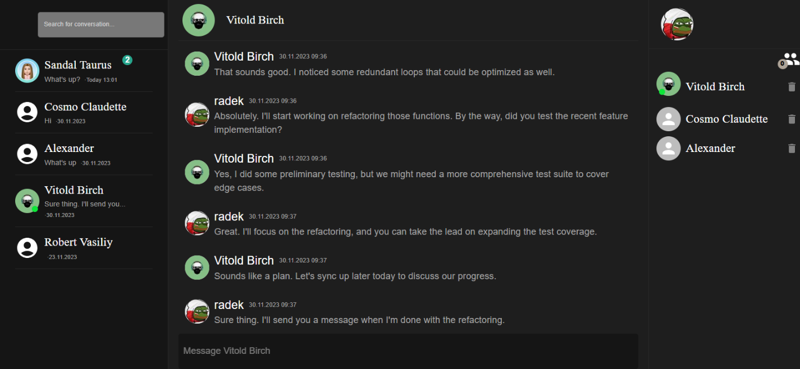

# Chat Application

This is a chat application built using React for the frontend and NestJS for the backend and PostgresSQL for the database, utilizing websockets for real-time communication.



## Project Structure

The project directory is structured as follows:

- `client/chat-app`: Contains frontend code.
- `server/chat-app`: Contains backend code.

## Getting Started

To run this application locally, follow the instructions below.

### Installation

1. Clone the repository and install dependencies:

   ```bash
   # Clone the repository
   git clone https://github.com/radekm2000/chat-app.git

   # Navigate to the frontend directory
   cd client/chat-app

   # Install frontend dependencies
   npm install

   # Navigate to the backend directory
   cd server/chat-app

   # Install backend dependencies
   npm install
   ```

### Environment Variables

1. **PostgreSQL Database Configuration**:

   - `POSTGRES_USER`
   - `POSTGRES_PASSWORD`
   - `POSTGRES_DB`

   Set these environment variables for configuring the PostgreSQL database

2. **Authorization Configuration**:

   - `ACCESS_TOKEN`
   - `REFRESH_TOKEN`

   Set these environment variables for authentication tokens

3. **Email Configuration**:

   - `MY_EMAIL`
   - `MY_EMAIL_PASSWORD` it is a third party app password

   Set these environment variables to enable sending email notifications to change account's password

4. **AWS S3 Bucket Configuration**:

   - `BUCKET_NAME`
   - `BUCKET_REGION`
   - `ACCESS_KEY`
   - `SECRET_ACCESS_KEY`

   Set these environment variables to configure access to the AWS S3 Bucket storage service (users' avatars are stored there)

   Note: Before setting up these variables, create your own AWS S3 Bucket and obtain the required access keys from there.

### Running the app

1.  Navigate to the frontend directory  
    cd client/chat-app and run **npm run dev**
2.  Navigate to the backend directory  
     cd server/chat-app and run **docker-compose up -d** to launch PostgresSQL database and **npm run start:dev**
    to run backend
